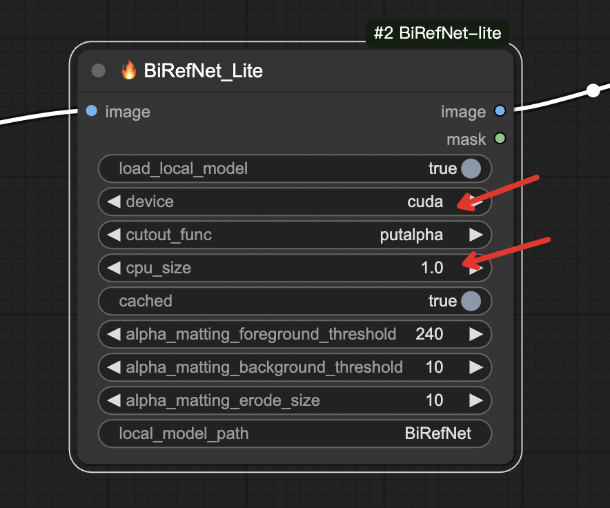
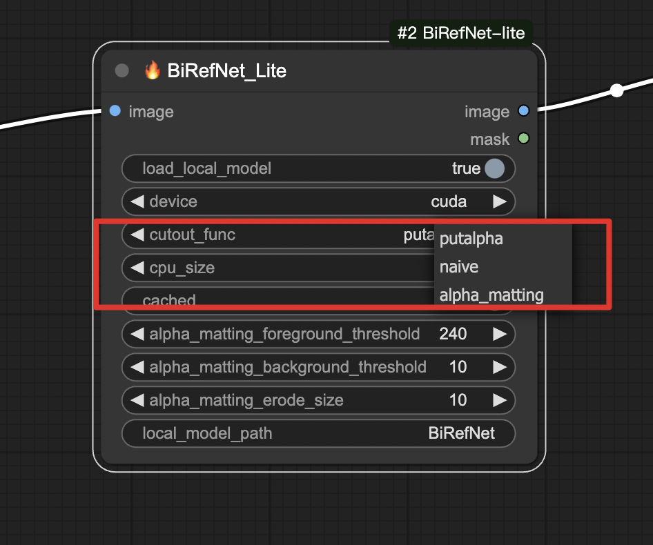
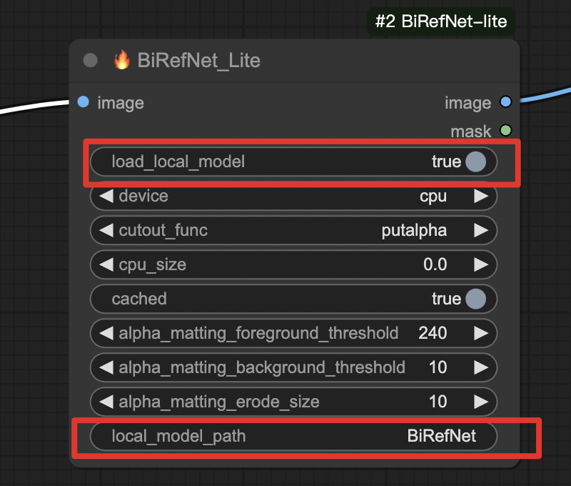
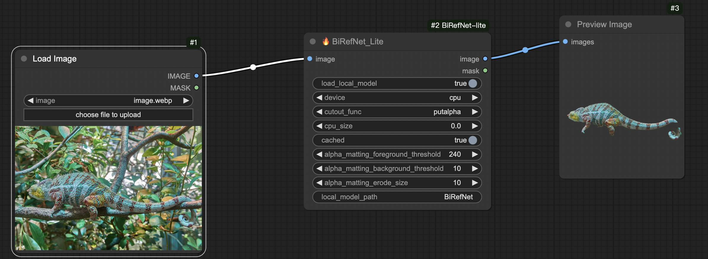
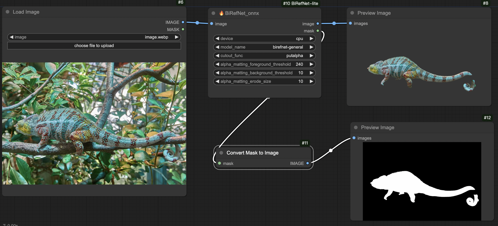

<h1 align="center">ComfyUI-BiRefNet-Super</h1>

      <a href="README.md">English</a> | 中文

## 介绍

本仓库将BiRefNet最新模型封装为ComfyUI节点来使用，并支持cpu和gpu分块加载，模型缓存特性。 
## 特性
特性1: 支持cpu和gpu分块加载 
在开启cuda的情况下，指定cpu_size，可将模型部分加载到cpu上
 
特性2: 模型缓存 
特性3: 多种裁剪方式 
支持putalpha, naive, alpha_matting三种裁剪方式
 
 

## News
- Nov 19, 2023: 增加`mask_precision_threshold`参数，控制mask的精度阈值，默认为0.1 

## 安装 

#### 方法1:

1. 进入节点目录, `ComfyUI/custom_nodes/`
2. `git clone https://github.com/rubi-du/ComfyUI-BiRefNet-Super.git`
3. `cd ComfyUI-BiRefNet-Super`
4. `pip install -r requirements.txt`
5. 重启ComfyUI

#### 方法2:
直接下载节点源码包，然后解压到custom_nodes目录下，最后重启ComfyUI

#### 方法3：
通过ComfyUI-Manager安装，搜索“ComfyUI-BiRefNet-Super”进行安装

## 使用

### BiRefNet_Super | BiRefNet_Lite

示例工作流放置在`ComfyUI-BiRefNet-Super/workflow`中 

加载模型有两种方式可选：一是自动下载并加载远程模型，二是加载本地模型（此时需将`load_local_model`设为true，并将`local_model_path`设置为指向models/birefnet目录下的本地模型路径，例如BiRefNet文件夹） 

___

#### 模型下载地址： 
BiRefNet: https://huggingface.co/ZhengPeng7/BiRefNet/tree/main 
BiRefNet_lite-2K: https://huggingface.co/ZhengPeng7/BiRefNet_lite-2K/tree/main 
BiRefNet-portrait: https://huggingface.co/ZhengPeng7/BiRefNet-portrait/tree/main 
BiRefNet-matting: https://huggingface.co/ZhengPeng7/BiRefNet-matting/tree/main 
RMBG-2.0: https://huggingface.co/briaai/RMBG-2.0/tree/main 

___
工作流workflow.json的使用 

___
工作流video_workflow.json的使用 
[workflow地址](./workflow/video_workflow.json)

### BiRefNet_onnx
示例工作流放置在 [workflow](./workflow/workflow-onnx.json)中 

模型下载完放置在 `ComfyUI/models/birefnet` 目录下. 

模型名称如下:
- birefnet-general.onnx
- birefnet-general-lite.onnx
- birefnet-portrait.onnx
- birefnet_massive.onnx
- birefnet-hrsod.onnx
- birefnet-dis.onnx
- birefnet-cod.onnx

  

#### 模型下载地址：   
birefnet-genernal: https://github.com/danielgatis/rembg/releases/download/v0.0.0/BiRefNet-general-epoch_244.onnx   
birefnet-genernal-lite: https://github.com/danielgatis/rembg/releases/download/v0.0.0/BiRefNet-general-bb_swin_v1_tiny-epoch_232.onnx  
birefnet-portrait: https://github.com/danielgatis/rembg/releases/download/v0.0.0/BiRefNet-portrait-epoch_150.onnx   
birefnet_massive: https://github.com/danielgatis/rembg/releases/download/v0.0.0/BiRefNet-massive-TR_DIS5K_TR_TEs-epoch_420.onnx  
birefnet-hrsod: https://github.com/danielgatis/rembg/releases/download/v0.0.0/BiRefNet-HRSOD_DHU-epoch_115.onnx   
birefnet-dis: https://github.com/danielgatis/rembg/releases/download/v0.0.0/BiRefNet-DIS-epoch_590.onnx   
birefnet-cod: https://github.com/danielgatis/rembg/releases/download/v0.0.0/BiRefNet-COD-epoch_125.onnx   

## 感谢

感谢BiRefNet仓库的所有作者 [ZhengPeng7/BiRefNet](https://github.com/zhengpeng7/birefnet)

部分代码参考了 [MoonHugo/ComfyUI-BiRefNet-Hugo](https://github.com/MoonHugo/ComfyUI-BiRefNet-Hugo) 感谢！

部分代码参考了 [danielgatis/rembg](https://github.com/danielgatis/rembg). 感谢！